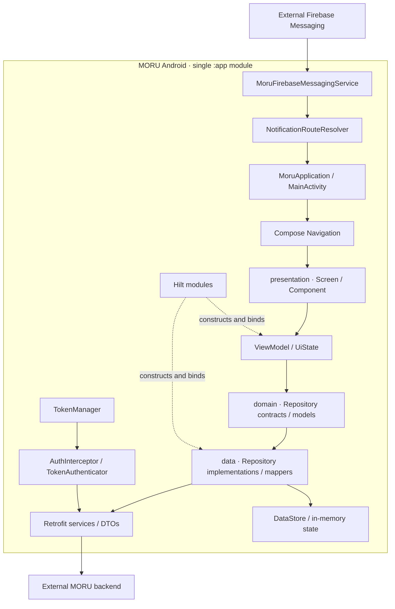
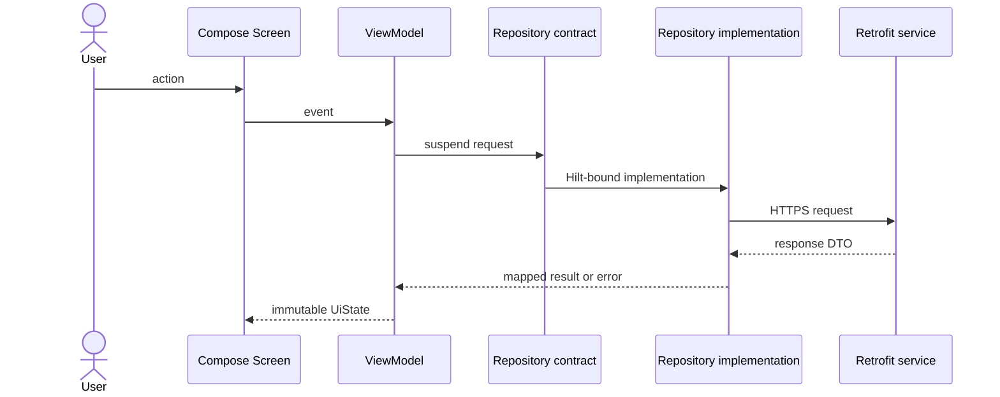

# MORU Android architecture and development guide

이 문서는 `projects/moru-android`의 현재 구조를 설명합니다. MORU는 하나의 Gradle `:app` 모듈 안에서 패키지로 책임을 나눈 **Clean-ish MVVM** 앱입니다. 계층 이름은 존재하지만 모듈 경계로 강제되지는 않으며, 팀 개발 과정에서 생긴 일부 역방향 의존도 남아 있습니다.

## System boundary



외부 백엔드와 Firebase 프로젝트는 이 저장소의 실행 환경에 포함되지 않습니다. 그림의 외부 연결은 코드상 통합 지점을 뜻하며, 실제 연동이 검증되었다는 의미가 아닙니다.

## Package map and responsibilities

```text
app/src/main/java/com/konkuk/moru/
├─ MainActivity.kt, MoruApplication.kt
├─ presentation/        # 기능별 Compose 화면, 컴포넌트, ViewModel, Navigation
├─ domain/
│  ├─ model, entity     # 앱에서 사용할 도메인 표현
│  └─ repository        # 데이터 접근 계약
├─ data/
│  ├─ service, dto      # Retrofit API와 전송 모델
│  ├─ repositoryimpl    # domain 계약 구현
│  ├─ mapper            # DTO/UI 표현 변환
│  ├─ interceptor       # 인증 헤더와 401 갱신
│  └─ token             # 인증 토큰 DataStore 접근
├─ di/                  # Hilt provider와 interface binding
├─ core/                # 공통 UI, validation, DataStore, utility
├─ ui/theme/            # MORU 색상과 typography
└─ viewmodel/shared/    # 여러 화면이 공유하는 레거시 ViewModel 위치
```

| 영역 | 새 코드의 의존 방향 | 경계 |
|---|---|---|
| `presentation` | `domain`, 필요한 `core`와 `ui` | API DTO나 Retrofit service를 화면에서 직접 사용하지 않기 |
| `domain` | Kotlin 중심의 자체 model과 repository contract | Android, Retrofit, `presentation` 타입에 의존하지 않기 |
| `data` | `domain`, 네트워크·저장소 라이브러리 | DTO를 계층 밖으로 반환하기 전에 mapper로 변환하기 |
| `di` | interface와 concrete implementation | 생성과 결합만 담당하고 기능 로직을 두지 않기 |
| `core`, `ui` | 여러 기능이 공유하는 최소 요소 | 특정 feature 상태나 서버 응답을 넣지 않기 |

### Current architectural debt

현재 코드를 완전한 Clean Architecture로 표현하면 과장입니다. 다음 결합은 동작을 보존하면서 단계적으로 제거할 대상입니다.

- 일부 `domain.repository` 계약이 `presentation` 모델이나 `data.dto`를 반환합니다.
- 일부 `data.service`, mapper와 dummy data가 `presentation` 타입을 참조합니다.
- 일부 ViewModel이 repository interface 대신 `data.repositoryimpl` 구현이나 DTO를 직접 사용합니다.
- `core`에는 공통 UI와 로컬 상태가 함께 있고, 루트 `viewmodel/shared`도 별도 feature 밖에 남아 있습니다.

우선순위는 “도메인 모델 정의 → mapper 추가 → repository 계약 정리 → presentation의 concrete import 제거” 순서입니다. 이 작업이 끝나기 전 feature/core 멀티모듈화부터 진행하면 잘못된 의존을 모듈 사이에 그대로 굳힐 수 있습니다.

## Main data flows

### Screen request



좋아요·스크랩처럼 즉시 반응이 필요한 흐름은 UI state를 먼저 갱신한 뒤 서버 실패 시 되돌리는 optimistic update도 사용합니다. 이 경우 rollback 상태와 동기화 이벤트까지 함께 테스트해야 합니다.

### Authentication and notification entry

- `TokenManager`는 access/refresh token과 세션 세대값을 DataStore에 저장하며 로그인 상태도 이 저장소에서 파생합니다. `AuthInterceptor`는 정확히 허용된 공개 인증 경로를 제외하고 같은 API origin의 요청에만 access token을 붙입니다.
- `TokenAuthenticator`는 제한된 횟수 안에서 refresh를 시도합니다. 네트워크 응답을 저장하기 직전 세대값과 기존 token pair를 한 DataStore transaction에서 다시 비교하므로, 대기 중 발생한 로그아웃이나 새 로그인을 과거 응답이 되돌리지 못합니다.
- 토큰은 소스에 하드코딩하지 않지만 현재 Android Keystore로 암호화되어 있지는 않습니다.
- FCM data는 `NotificationRouteResolver`가 허용된 상세 route로 정규화하고, service가 이를 `MainActivity` intent에 담습니다. Activity는 인증된 내부 NavGraph가 준비될 때까지 route를 보관한 뒤 한 번만 이동합니다.
- 알림과 방해 금지 모드 제어 권한은 관련 기능을 위한 선택 사항이며 온보딩 완료를 막지 않습니다. 사용자가 항목을 누르면 기존 알림 권한 요청 또는 방해 금지 설정 진입 동작을 수행합니다.
- 이 흐름은 코드와 로컬 빌드 범위에서만 확인했으며, 실제 Firebase 수신·알림 클릭·백엔드 토큰 등록은 검증하지 않았습니다.

## Local configuration

필수 환경은 Android SDK 35와 JDK 17 이상입니다. CI는 Temurin JDK 21을 사용합니다. AGP 8.11은 Windows의 비ASCII 프로젝트 경로를 거부하므로 영문·숫자 경로에 clone하는 편이 안전합니다.

```powershell
cd projects\moru-android
Copy-Item local.properties.example local.properties
.\gradlew.bat testDebugUnitTest testReleaseUnitTest verifyLintWarningBudget assembleDebug assembleRelease
```

`local.properties`에는 개발자별 SDK 경로와 API 주소만 두고 commit하지 않습니다. API 주소는 아래 우선순위로 결정되며 반드시 `https://`로 시작해야 합니다.

1. Gradle property: `-PMORU_BASE_URL=https://api.example.com/`
2. 환경 변수: `MORU_BASE_URL=https://api.example.com/`
3. `local.properties`: `base.url=https://api.example.com/`
4. 미설정 시 빌드 전용 기본값: `https://example.invalid/`

Firebase를 연결하려면 각 개발자가 자신의 `app/google-services.json`을 추가해야 합니다. 이 파일은 Git에서 제외됩니다. 파일이 없으면 Google Services plugin을 적용하지 않아 일반 빌드는 가능하지만, Firebase 인증·메시징의 실제 동작을 보장하지 않습니다.

## Development workflow

1. 기능의 화면 상태와 사용자 이벤트를 `presentation/<feature>`에 정의합니다.
2. 외부 데이터가 필요하면 `domain`에 앱 관점의 model과 repository contract를 먼저 정의합니다.
3. `data`에 request/response DTO, Retrofit service, mapper, repository implementation을 추가합니다.
4. `di`에서 interface와 implementation을 연결합니다. ViewModel은 가능한 한 interface만 주입받습니다.
5. 새 화면은 중앙 `Route`와 NavGraph 양쪽에 등록하고, 문자열 인자는 인코딩합니다.
6. 정상·빈 값·실패·재시도 상태를 테스트하고 전체 검증 명령을 실행합니다.
7. 구조나 설정이 바뀌면 이 문서와 [`projects/moru-android/README.md`](../projects/moru-android/README.md)를 함께 갱신합니다.

### Comment policy

주석은 코드가 **무엇을 하는지** 반복하기보다 선택한 이유, 보안·동시성 제약, 되돌림 조건처럼 코드만으로 알기 어려운 내용을 설명합니다.

- public contract나 인코딩·동기화 규칙에는 짧은 KDoc 또는 근거 주석을 남깁니다.
- `추가`, `수정`, 이모지 같은 변경 이력 주석은 commit이 대신하므로 새로 만들지 않습니다.
- 임시 작업은 `TODO`에 완료 조건이나 추적 이슈를 함께 적습니다.
- token, 사용자 입력, request/response body, 앱 목록을 로그나 주석 예시에 넣지 않습니다.
- 자명한 한 줄을 해설하는 주석은 제거하고, 코드 이름으로 의도를 드러냅니다.

## Verification and CI

로컬과 CI의 기준 명령은 다음과 같습니다.

```bash
./gradlew testDebugUnitTest testReleaseUnitTest verifyLintWarningBudget assembleDebug assembleRelease
```

`.github/workflows/moru-android.yml`은 MORU 경로나 workflow가 바뀐 pull request, `main` push, 수동 실행에서 같은 다섯 작업을 수행합니다. `testDebugUnitTest`와 `testReleaseUnitTest`는 두 build variant의 JVM 정책 테스트를, `verifyLintWarningBudget`은 Lint 오류와 214개 경고 상한을, `assembleDebug`와 `assembleRelease`는 Debug APK와 unsigned Release APK 조립 가능성을 확인합니다. 기존 경고를 숨기지 않고 XML 보고서를 유지하며, 경고가 정리될 때 예산도 함께 낮춰 전체 경고 수가 다시 늘어나는 회귀를 막습니다. 단위 테스트는 인증 입력 규칙, 인증 헤더·origin 경계, 동일 저장소의 레거시 token 이관, 세션 조건부 교체, 알림 route, HTTP·통신 실패 시 스케줄 보존, 비동기 step 선택과 루틴별 상태 격리처럼 Android 런타임에서 분리할 수 있는 정책을 검증합니다. 다음 단계에서는 repository mapper, ViewModel state transition, 실제 인증 갱신과 optimistic update rollback 테스트를 우선 보강합니다.

이 gate의 통과 범위는 JVM 단위 테스트, Android Lint, Debug APK와 unsigned Release APK 조립까지입니다. release 조립은 서명이나 배포 가능성을 검증하지 않습니다. 다음 항목은 별도 환경과 시나리오가 필요하며 현재 완료로 주장하지 않습니다.

- 실제 MORU Server API 계약과 전체 사용자 흐름
- 실제 Firebase 프로젝트의 인증, token 등록, push 수신과 알림 클릭
- 실기기 권한, 백그라운드, 제조사별 동작
- instrumented/UI/E2E 테스트
- release 서명, 난독화, 배포용 번들 및 스토어 심사

## Attribution

이 구조는 4인 팀 결과를 기준으로 한 개인 포트폴리오 사본입니다. 팀 원본 기준점과 가져오기 방식은 [`SOURCE_MANIFEST.md`](SOURCE_MANIFEST.md), `jhsoo0211` 명의로 병합된 작업과 이후 개인 유지보수의 구분은 [`CONTRIBUTIONS.md`](CONTRIBUTIONS.md), 권리 경계는 [`NOTICE.md`](../NOTICE.md)에 기록합니다.
