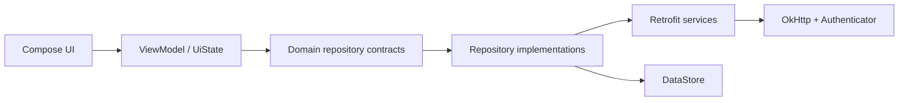

# MORU Android

MORU는 다른 사용자의 루틴을 탐색하고 내 생활에 적용할 수 있도록 돕는 루틴 소셜 앱입니다. KUIT 과정에서 Android 개발자 4명이 함께 구현했습니다. 실제 서버와 Firebase 설정은 이 포트폴리오 사본에 포함하지 않습니다.

## Main flows

- 루틴 피드 탐색, 상세 조회와 검색
- 사용자 프로필, 팔로우·팔로워
- 루틴 스크랩과 내 루틴 추가
- 내 루틴 일정·상세·수정 관리
- 알림 및 FCM 기반 루틴 상세 이동

## Architecture



단일 `app` 모듈 안에서 `presentation`, `domain`, `data`, `di`, `core` 패키지로 역할을 나눈 Clean-ish MVVM 구조입니다. 장기적으로는 feature/core 모듈 분리가 가능하지만, 이 사본에서는 먼저 보안과 재현 가능한 빌드를 정비했습니다.

이 경계는 아직 Gradle 모듈로 강제되지 않으며 일부 레거시 역방향 의존이 남아 있습니다. 실제 package 책임, 요청 흐름, 리팩터링 순서와 주석 원칙은 [아키텍처·개발 가이드](../../docs/MORU_ARCHITECTURE.md)에 과장 없이 기록했습니다.

## Build

필수 환경:

- JDK 17 이상
- Android SDK 35

AGP 8.11은 Windows의 비ASCII 프로젝트 경로를 차단합니다. Windows에서는 영문·숫자로만 된 경로에 clone한 뒤 빌드하세요.

기본 API 주소는 의도적으로 `https://example.invalid/`입니다. 실제 백엔드에 연결하려면 다음 중 하나로 HTTPS URL을 제공하세요.

1. Gradle property: `-PMORU_BASE_URL=https://api.example.com/`
2. 환경 변수: `MORU_BASE_URL=https://api.example.com/`
3. git-ignored `local.properties`: `base.url=https://api.example.com/`

```bash
./gradlew testDebugUnitTest lintDebug assembleDebug
```

Windows PowerShell에서는 같은 위치에서 `./gradlew` 대신 `.\gradlew.bat`을 사용합니다. 설정 우선순위와 변경 절차는 [아키텍처·개발 가이드](../../docs/MORU_ARCHITECTURE.md#local-configuration)를 참고하세요.

Firebase 기능을 실제로 사용하려면 본인 프로젝트의 `app/google-services.json`을 추가해야 합니다. 이 파일은 Git에 포함되지 않으며, 파일이 없을 때는 Google Services plugin도 적용하지 않아 일반 컴파일을 막지 않습니다.

### Verified on 2026-08-16

최종 소스를 기준으로 캐시를 사용하지 않고 세 작업을 함께 재실행했습니다.

- `testDebugUnitTest`: 18 tests, failures 0, errors 0, skipped 0
- `lintDebug`: 0 errors, 231 warnings, 7 hints
- `assembleDebug`: 성공, APK 38,182,379 bytes
- APK SHA-256: `ED01678E37D5E4353354AC2DC28B372BB487F65E51307F35367BD2CA10F44326`

이 검증은 로컬 컴파일·단위 테스트·정적 분석 범위입니다. 실제 서버, Firebase, 실기기 알림, release 서명과 전체 사용자 흐름은 검증하지 않았습니다.

## Portfolio hardening

- trust-all 인증서·hostname verifier와 cleartext 허용 제거
- 하드코딩 인증 token과 인증·FCM·사용자 작성 내용·설치 앱 목록 로그 제거
- 선택적 로컬 설정과 HTTPS-only base URL 적용
- 중복 permission, release 산출물, 임시 파일 정리
- FCM deep link를 허용 목록 기반 canonical route resolver로 통합
- 인증 입력·헤더 경계·레거시 token 이관·세션 교체·알림 route에 단위 테스트 추가
- PR 및 `main` 변경 시 unit test, Lint와 debug assemble을 실행하는 CI 추가

현재 인증 token은 DataStore에 저장됩니다. 이번 정리에서는 코드·로그 노출을 줄였지만 Android Keystore 기반 저장 암호화까지 구현한 것은 아닙니다.

## Project boundary

팀 원본의 기준점은 [`master@9a6a7d1`](https://github.com/KUIT-MORU/KUIT_MORU_Android/commit/9a6a7d1ff7a0070e5e860ba7b9336c1ceaab643f)입니다. 이 디렉터리의 후속 개선은 개인 포트폴리오 사본에만 적용되며 원본 팀 저장소를 바꾸지 않습니다. 서버 코드는 포함하지 않았으므로 실제 데이터 흐름에는 별도 팀 백엔드와 유효한 구성이 필요합니다.

컴파일과 단위 테스트 성공은 실제 서버, Firebase, 알림 클릭, release 서명 또는 전체 사용자 흐름 E2E까지 검증했다는 뜻은 아닙니다.

- [개인 기여 PR](../../docs/CONTRIBUTIONS.md)
- [원본과 import 기록](../../docs/SOURCE_MANIFEST.md)
- [저장소 구조와 학습 경로](../../docs/REPOSITORY_GUIDE.md)
- [아키텍처와 개발 절차](../../docs/MORU_ARCHITECTURE.md)
- [저작권 경계](../../NOTICE.md)
